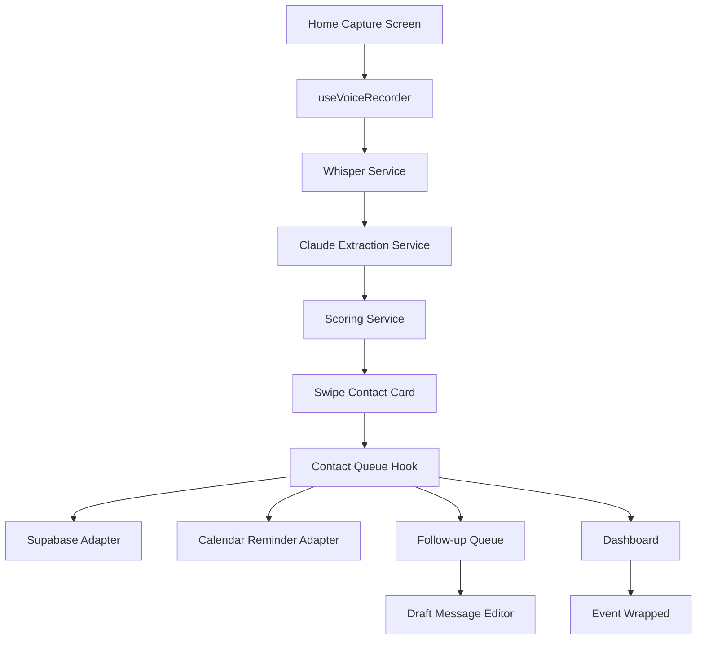

# Architecture

## Frontend
The app is a single Expo React Native entry point with local tab state. This keeps the hackathon demo reliable while preserving a structure that can move to Expo Router later.

## AI Layer
`src/services/whisper.ts` and `src/services/claude.ts` contain real API call paths guarded by environment variables. Without keys, they return deterministic demo outputs.

## Scoring
`src/services/scoring.ts` computes:
- Role seniority
- Company tier
- Intent weight
- Career relevance
- Recency bonus
- Estimated career value from a salary-band fallback

## Data
The current app uses in-memory state for a zero-setup demo. `supabase/migrations/001_initial_schema.sql` defines the database shape for persistence and row-level security.
