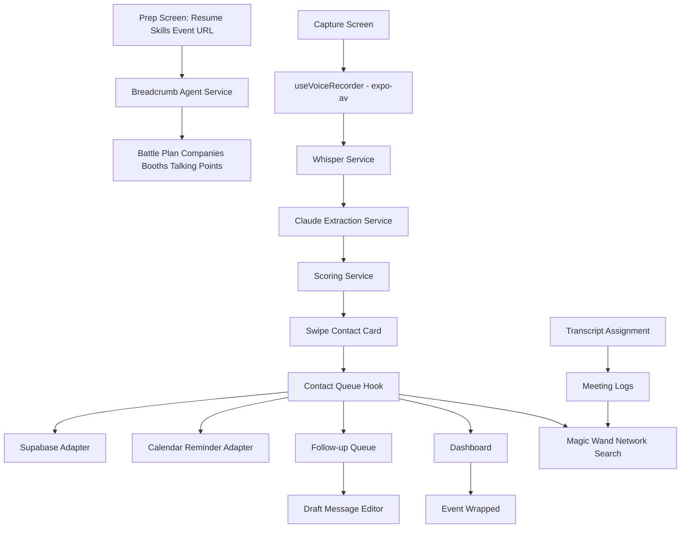

# Architecture

## Frontend
The app is a single Expo React Native entry point with local tab state. This keeps the hackathon demo reliable while preserving a structure that can move to Expo Router later.

## Breadcrumb Prep
`src/screens/PrepScreen.tsx` lets the user teach Breadcrumb about their resume, skills, and target roles. It also runs a deterministic event URL analysis through `src/services/breadcrumb.ts`, producing a ranked battle plan of companies, booths, hiring signals, and talking points.

## Meeting Memory
Breadcrumb accepts live voice memos through the capture screen and pasted Zoom/booth transcripts through the Prep screen. `analyzeMeetingTranscript` extracts summaries, key points, and action items, then assigns the log to an existing contact in memory.

## Magic Wand Search
`src/screens/WandScreen.tsx` lets users ask who in their network can help. `searchNetwork` ranks contacts using names, companies, roles, snippets, key details, and assigned meeting logs.

## Voice Capture
`src/hooks/useVoiceRecorder.ts` uses `expo-av` `Audio.Recording` for real microphone capture on iOS/Android. It requests permissions, records to `.m4a`, and auto-stops at 60 seconds. On web or when permissions are denied, it falls back to a simulated waveform and demo URI.

## AI Layer
`src/services/whisper.ts` sends real audio to the OpenAI Whisper API when `EXPO_PUBLIC_OPENAI_API_KEY` is set. `src/services/claude.ts` sends transcripts to Claude with the full extraction prompt from `.kiro/steering/extraction-prompt.md` when `EXPO_PUBLIC_ANTHROPIC_API_KEY` is set. Both services return deterministic demo data when keys are absent.

## Scoring
`src/services/scoring.ts` computes:
- Role seniority (0–3 points)
- Company tier (0–2 points)
- Intent weight (recruiting highest, peer lowest)
- Career relevance (0–2 points)
- Recency bonus (decays 10% per week)
- Estimated career value from salary-band data

## Data
`src/services/supabase.ts` persists contacts, events, and follow-up drafts to Supabase Postgres when `EXPO_PUBLIC_SUPABASE_URL`, `EXPO_PUBLIC_SUPABASE_ANON_KEY`, and an authenticated user session are present. Row-level security ensures users own their data. Without Supabase config or without a session, an in-memory Map provides the same interface for zero-setup demos.

## Current Boundaries
- The app has the Supabase data adapter and RLS schema, but does not yet include auth screens.
- Breadcrumb event intelligence, resume parsing, and network search are deterministic local agent simulations; production versions should move to edge functions and embeddings.
- Google Calendar integration is represented by a reminder adapter and env placeholders; OAuth is still pending.
- Mobile recording uses `expo-av`; web remains a reliable demo path with a simulated URI.

## Edge Function
`supabase/functions/process-voice-memo/index.ts` implements the full server-side pipeline: fetch audio → Whisper transcription → Claude extraction → return structured result.
