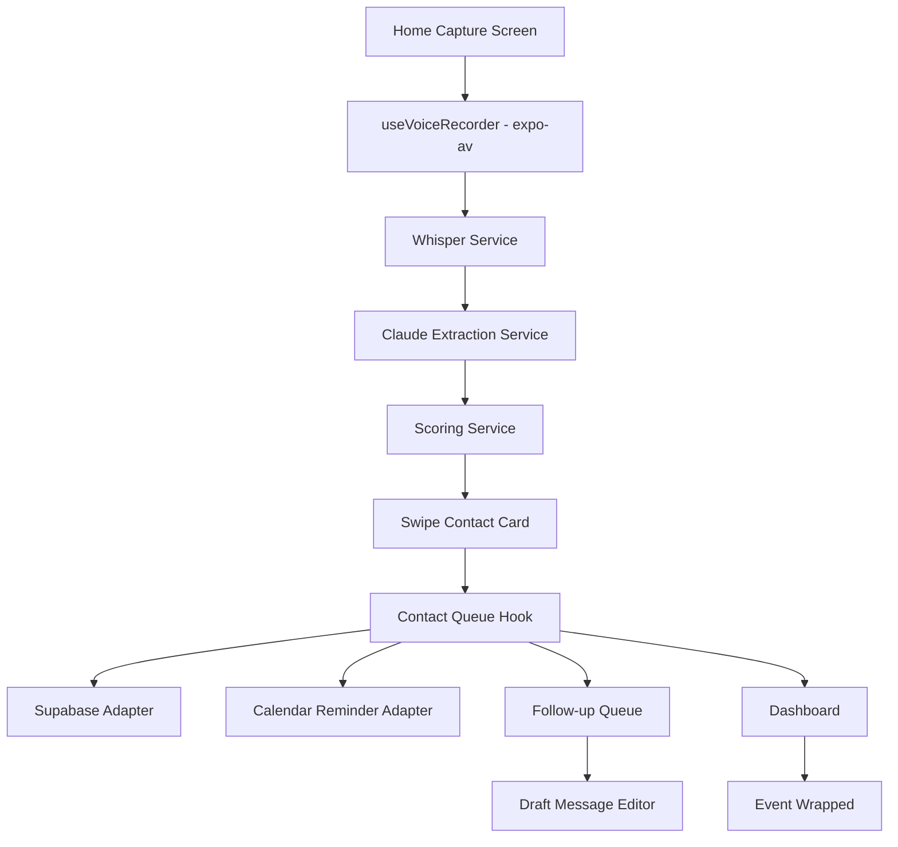

# Architecture

## Frontend
The app is a single Expo React Native entry point with local tab state. This keeps the hackathon demo reliable while preserving a structure that can move to Expo Router later.

## Voice Capture
`src/hooks/useVoiceRecorder.ts` uses `expo-av` `Audio.Recording` for real microphone capture on iOS/Android. It requests permissions, records to `.m4a`, and auto-stops at 60 seconds. On web or when permissions are denied, it falls back to a simulated waveform and demo URI.

## AI Layer
`src/services/whisper.ts` sends real audio to the OpenAI Whisper API when `EXPO_PUBLIC_OPENAI_API_KEY` is set. `src/services/claude.ts` sends transcripts to Claude with the full extraction prompt from `.kiro/steering/extraction-prompt.md` when `EXPO_PUBLIC_ANTHROPIC_API_KEY` is set. Both services return deterministic demo data when keys are absent.

## Scoring
`src/services/scoring.ts` computes:
- Role seniority (0–3 points)
- Company tier (0–2 points)
- Intent weight (recruiting highest, peer lowest)
- Career relevance (0–2 points)
- Recency bonus (decays 10% per week)
- Estimated career value from salary-band data

## Data
`src/services/supabase.ts` persists contacts, events, and follow-up drafts to Supabase Postgres when `EXPO_PUBLIC_SUPABASE_URL` and `EXPO_PUBLIC_SUPABASE_ANON_KEY` are set. Row-level security ensures users own their data. Without Supabase config, an in-memory Map provides the same interface for zero-setup demos.

## Edge Function
`supabase/functions/process-voice-memo/index.ts` implements the full server-side pipeline: fetch audio → Whisper transcription → Claude extraction → return structured result.
