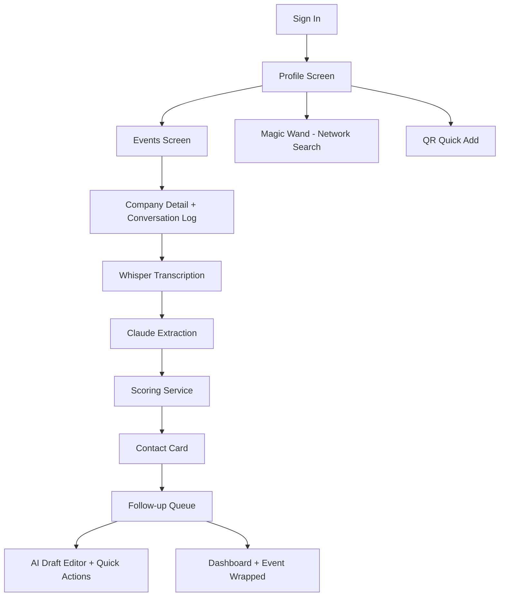

# Architecture

## App Flow
1. Sign in → Profile (editable bio, resumes, skills, QR)
2. Events → View attending companies, booth summaries, recruiter lists, pitch hints
3. Attend Booth → Log conversation via text, voice, or upload → AI review with key points and action items
4. Follow Up → Prioritized queue → AI-drafted messages with "Make shorter", "More formal", "Add skill highlight"
5. Magic Wand → Job Search by title/company or Referral Assist with example prompts
6. QR → Share identity code for quick exchange

## Voice Capture
`src/hooks/useVoiceRecorder.ts` uses `expo-av` `Audio.Recording` for real microphone capture on iOS/Android. It requests permissions, records to `.m4a`, and auto-stops at 60 seconds. On web or when permissions are denied, it falls back to a simulated waveform and demo URI.

## AI Layer
- `src/services/whisper.ts` — OpenAI Whisper API when `EXPO_PUBLIC_OPENAI_API_KEY` is set
- `src/services/claude.ts` — Claude extraction (following `.kiro/steering/extraction-prompt.md`) and draft generation when `EXPO_PUBLIC_ANTHROPIC_API_KEY` is set
- `src/components/FollowUp/DraftMessage.tsx` — Claude-powered quick actions for draft refinement
- `src/services/ghosty.ts` — Network search, event analysis, meeting transcript analysis

All services return deterministic demo data when keys are absent.

## Scoring
`src/services/scoring.ts` computes a transparent Connection Value Score (1-10):
- Role seniority (0-3 points)
- Company tier (0-2 points)
- Intent weight (recruiting highest, peer lowest)
- Career relevance (0-2 points)
- Recency bonus (decays 10% per week)
- Estimated career value from salary-band data

## Data
Demo data in `src/data/sampleData.ts` uses real mentors from the Kiro Spark Challenge: Aditya Challa, Brian Eisenlauer, Harsh Tita, Aditya Vikram Parakala, Danny Kim, Jeffrey Mills, Arun Arunachalam, Evan Elezaj, and Madhu Nagaraj from AWS, Amazon, Toptal, and AI Cloud Innovation Center.

## Production Path
- `supabase/migrations/001_initial_schema.sql` — Postgres schema with RLS for contacts, events, follow_up_drafts
- `supabase/functions/process-voice-memo/index.ts` — Server-side Whisper → Claude pipeline
- `src/services/calendar.ts` — Google Calendar MCP integration stub
